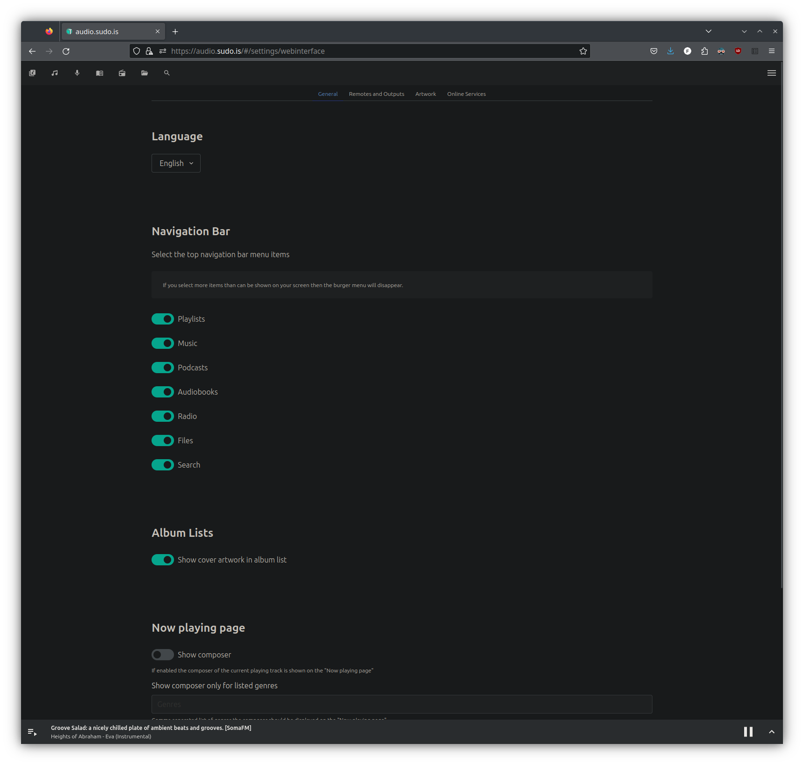

# `build-owntone`

[](https://jenkins.sudo.is/job/ben/job/build-owntone/job/main/)
[](https://git.sudo.is/ben/build-owntone/packages)
[](https://git.sudo.is/ben/build-owntone)
[](https://github.com/benediktkr/build-owntone)
[](https://matrix.to/#/@ben:sudo.is)

A custom build of the latest stable version of [OwnTone](https://github.com/owntone/owntone-server) (formerly forked-daapd).

[](https://github.com/owntone)

This projects builds, compiles and packages OwnTone, publishing both `.deb` packages
and docker containers of the latest stable version.

## Changes to OwnTone

This build includes some (minor) custom changes to Owntone

 * Attempting to use a dark theme (css was generated by the Dark Reader
   extension for Firefox).
 * Builds the web interface from `web-src` sources.
    * Defaults to building the web interface, but can be disabled.
    * Builds also contain the pre-compiled web interface in `htdocs`
    * Builds web interface without minimized javascript
    * Web socket is access by the web interface on `/ws` (requires reverse proxy) instead of
      separate port (see [`web-change-ws-url.sh`](.pipeline/web-change-ws-url.sh))
 * Example nginx vhost config file is included
   (see [`01-owntone.conf`](etc/nginx/sites-available/01-owntone.conf)).

TODO changes:

 * Change the default action to add an item to the queue instead of replacing the queue (see notes below). On
   a phone or touchscreen it is not so easy to tap the hamburger menu and I often accidentally wipe out my
   current queue.

### Not a fork

I don't want to have to maintain a whole fork of OwnTone, and these are all
relatively small and simple, so they are just applied on build-time with shell
scripts.

## Installing and usage

Config and example files:

  * [`owntone.conf`](etc/owntone.conf): OwnTone config file with sane defaults
    for this build.
  * [`01-owntone.conf`](etc/nginx/sites-available/01-owntone.conf): Nginx vhost.
  * [`owntone-docker.yml`](ansible/owntone-docker.yml): Ansible example tasks for
    running the docker container.

### Installing `.deb` with `apt`

You can either user [the gitea repo from `git.sudo.is`](https://git.sudo.is/ben/-/packages/debian/owntone-server/) or [`apt.sudo.is`](https://apt.sudo.is) repo.

For `git.sudo.is`:

```shell
sudo curl https://git.sudo.is/api/packages/ben/debian/repository.key -o /etc/apt/keyrings/git.sudo.is-ben.asc
echo "deb [signed-by=/etc/apt/keyrings/git.sudo.is-ben.asc] https://git.sudo.is/api/packages/ben/debian $distribution main" | sudo tee -a /etc/apt/sources.list.d/git.sudo.is-ben.list
sudo apt update
sudo apt install owntone-server
```

For `apt.sudo.is`:

```shell
sudo curl https://apt.sudo.is/KEY.gpg -o /etc/apt/keyrings/apt.sudo.is.gpg
echo "deb [signed-by=/etc/apt/keyrings/apt.sudo.is.gpg] https://apt.sudo.is /" | sudo tee -a /etc/apt/sources.list.d/apt.sudo.is.list
sudo apt update
sudo apt install owntone-server
```

Generally the `git.sudo.is` mirror should probably be preferred.

### Docker container

For Ansible users, an example `docker_container` task is in [`owntone-docker.yml`](ansible/owntone-docker.yml).

The docker images are based on the `ubuntu:latest` base image, because of the
complex dependencies, and I was not able to figure out how to compile
a static binary. I tried following the github pipeline in [`owntone/owntone-apt`](https://github.com/owntone/owntone-apt)
but opted for using `fpm` to build a simple `.deb` package. Owntone is compiled and
packaged in the `builder` stage, and then installed in the `final` stage.

To run as a non-root user, you need to use `avahi-daemon` and `dbus` from the
host.

 * https://github.com/mviereck/x11docker/issues/271
 * https://github.com/mviereck/x11docker/wiki/How-to-connect-container-to-DBus-from-host

To do that you can either run the container as `--privileged` (wrong), or
set `--security-opt apparmor=unconfined` to circumvent AppArmor (better). In both
cases, the process acessing `/var/run/avahi-daemon/socket` needs to have the
same UID as owns the socket.

```shell
docker run \
    -it \
    --name owntone \
    --net=host \
    --security-opt apparmor=unconfined \
    --user ${uid}:${gid} \
    -v /var/run/dbus:/var/run/dbus \
    -v /run/avahi-daemon/socket:/run/avahi-daemon/socket \
    -v /usr/local/etc/owntone.conf:/etc/owntone.conf \
    -v /var/lg/owntone.log:/var/log/owntone.log \
    -v /var/cache/owntone/:/var/cache/owntone \
    -v /srv/audio/:/srv/audio \
    git.sudo.is/ben/owntone-server:latest
```

The container has the build args `OWNTONE_UID` and `OWNTONE_GID` if you
want to build it with a different default user for running OwnTone. Note
that you can change the defaults paths `/srv/audio` and
`/var/cache/owntone` in `owntone.conf` to better suit your needs, if
you want.

The container can also be started as root, and then the `owntone` binary `setuid`s
itself down to the user that you have specified in
`owntone.conf`. This is the default and expected behaviour of OwnTone.

```shell
docker run \
    -it \
    --name owntone \
    --net=host \
    --user 0 \
    -v /usr/local/etc/owntone.conf:/etc/owntone.conf \
    -v /var/log/owntone.log:/var/log/owntone.log \
    -v /var/cache/owntone/:/var/cache/owntone \
    -v /srv/audio/:/srv/audio \
    git.sudo.is/ben/owntone-server:latest
```

When the container is started as root, neither the dbus nor avahi-daemon sockets
need to be mounted, because the container will start its own before launching OwnTone.

Note that this username (cant specify uid) has to
exist in the container (so if you want to change it you can rebuild the
container with different `UID` and `GID` build args, use some other UID that
already exists in the containers `/etc/passwd` or create a new
user in a custom `entrypoint.sh` script.)

## Differences from upstream OwnTone

### Websocket accessed on `/ws` via reverse proxy

By default OwnTone will spawn a websocket server on port thats separate from the main
port (used for the API and webinterface), because it is not expecting to be run behind
a reverse proxy. But if you do have a reverse proxy in front of OwnTone (like me), its
generally nicer to not have to deal with nonstandard ports and manage extra certificates
for them.

Since this isnt a fork, and we're keeping the changeset to a minimum, how OwnTone's
websocket server listens hasn't actually been changed. Instead, we've just changed
what address the web interface uses to connect to the websocket, and then we let the
reverse proxy take care of proxying that to OwnTone's websocket server.

This is the change to the web interface:

```diff
diff --git a/web-src/src/App.vue b/web-src/src/App.vue
index 0636fa10..1f6b0bc7 100644
--- a/web-src/src/App.vue
+++ b/web-src/src/App.vue
@@ -168,6 +168,7 @@ export default {
           vm.$store.state.config.websocket_port
       }

+      wsUrl = protocol + window.location.hostname + '/ws'
       const socket = new ReconnectingWebSocket(wsUrl, 'notify', {
         reconnectInterval: 1000,
         maxReconnectInterval: 2000
```

We just re-define the `wsUrl` variable, right before it gets used (for the one and only
time). Simple.

The settings `websocket_interface` and `websocket_port` port are still used by OwnTone,
amd so are `port` and `bind_address` for the API. In fact, if you `GET /api/config`
the response still uses the `websocket_port` value:

```console
local:~$ curl -i https://${owntone_url}/api/config | jq .
{
  "websocket_port": 3688,
  // ...
}
```

Normally, the web interface reads this and uses the `websocket_port` in the response for
to construct the URL that it tries to connect to the websocket server on. It still reads
this config, it just doesn't end up using `websocket_port` because we have re-defined it.

Since the config options are still used by OwnTone, we just need to configure OwnTone
to bind both the API server and websocket server to `localhost` in `owntone.conf`. This
build [inclues a default `owntone.conf` file](etc/owntone.conf) that uses the default
ports but binds both servers to `localhost`:

```nginx
general {
    # TCP port to listen on. Default port is 3689 (daap)
    port = 3689
    bind_address = "127.0.0.1"          # default: "0.0.0.0"

    websocket_port = 3688
    websocket_interface = "127.0.0.1"   # default: "0.0.0.0"
}
```

Since both are now only listening on `localhost`, we need a reverse proxy to proxy
the traffic to OwnTone. These builds include a config for Nginx, but you can of
course use any old HTTP(S) reverse proxy. Note that due to some idiosyncrasies
of the DAAP protocol, most clients expect to talk to OwnTone in HTTP/1.1. Some clients
work fine with HTTP/2 (for example Apple Remote) but others won't work and give you
somewhat confusing errors about mismatching versions (implying that it is about the
version of OwnTone or the DAAP protocol).

An example vhost config file [`01-owntone.conf`](etc/nginx/sites-available/01-owntone.conf)
for Nginx is provided.


If you use Nginx, it is a little bit peculiar about how HTTP versions in the `listen`
directive are set. All virtual hosts with the same `address:port` par will use the same
http version, though the [nginx documentation for the `ngx_http_core_module`](https://nginx.org/en/docs/http/ngx_http_core_module.html#listen)
makes no mention of this:

> The `http2` parameter (1.9.5) configures the port to accept HTTP/2 connections.
> Normally, for this to work the ssl parameter should be specified as well,
> but nginx can also be configured to accept HTTP/2 connections without SSL.

It's not possible to configure different virtual hosts (on the same `address:port`) to
serve different HTTP versions, Nginx _will always use the HTTP version set in the first
virtual host that it finds, and ignore the setting for all other virtual hosts_. If you
try to specify a "narrower" `address:port` pair than other vhsots, then your OwnTone
vhost will become the default for that pair, and start responding for other vhosts as
well. If this is a limitation that you have to work around (and you want to keep using
nginx) then the best option is to assign a second IP address to the host, and not bind
any other nginx vhosts (that use HTTP/2) to it.


### Partial filescans from [`owntone-server#1179`](https://github.com/owntone/owntone-server/pull/1179)


There is an open PR [`owntone-server#1179`](https://github.com/owntone/owntone-server/pull/1179)
from [:github: whatdoineed2do](https://github.com/whatdoineed2dothat) that
adds support for partial library file scans. This branch/fork also includes some
rather neat UI improvements to the web interface.

This featue is very useful if your library is on a network mount (no `inotify`) and
you for example liksten to mostly podcasts and want your library/queue stay up to date.

This build doesnt include this change by default, but you can enable it if you
build it yourself.

```shell
scan_path=/media/audio/podcasts
curl -X PUT "https://${owntone_url}/api/update?kind=files&path=${scan_path}"
```

Will start a partial library recan, scanning only `$scan_path` without rescanning
the rest of the library.

## Work in progress and future changes

### Dark Reader theme

This is a work in progress to build the web interface with the dark theme generated by
the [Dark Reader](https://github.com/darkreader/darkreader) Firefox extension.

As I lack moden HTML/CSS skills and havent gotten it to work yet (help welcome).



These are the relevant files:

 * [`dark-reader.css`](dark-reader/dark-reader.css): CSS exported from the Dark Reader Firefox extension
 * [`index.html`](dark-reader/index.html): A copy of `index.html` the includes `<link>` tag
   to include `dark-reader.css`
 * [`web-add-dark-reader.sh`](.pipeline/web-add-dark-reader.sh): Script that gets invoked
   during the build if `OWNTONE_WEB_DARK_READWER` is `"true"`.

Some references:

 * https://stackoverflow.com/questions/62797830/using-dark-reader-extension-code-for-your-own-website
 * https://github.com/darkreader/darkreader/issues/11638


### UI improvements

When clicking an item in the UI, the default is replace the current queue with whatever it
was that you clicked.

The is slightly annoying, especially when using a phone or touch-interface to navigate
OwnTone. I find that trying to hit the three-dots hamburger menu often results in accidentally
selecting the item, and replacing the queue.

A better default would be to "Add to queue" or evben "Add next", instead of replacing
the whole queue.

I think this happens in or around [`/src/webapi/index.js#L92`](https://github.com/owntone/owntone-server/blob/master/web-src/src/webapi/index.js#L78-L112),
or at least that should provide enough clues to find it in the code.

When an item is clicked in the web interface, a `POST` request is sent, for example:  `/api/queue/items/add?uris=library:track:40397&shuffle=false&clear=true&playback=start`.

Breaking the parameters down into more-readable JSON:

```json
{
    "uris": "library:track:1234",
    "shuffle": false,
    "clear": true,
    "playback": start
}
```

Basically, we would want to send a request with `?clear=false` instead.

### Maintaining more complex changes without forking

To manage more complex changes without needing a fork, you can use `git diff`s
as `.patch` files.

Create the patch file:

```shell
cd owntone-server
git diff --no-prefix --patch > ../${name}.patch
```

Then apply the patch file:

```shell
patch -p1 -t -i ../${name}.patch

# or by using git:
git apply ../${name}.patch
```

### mdns

To forward mdns packets from the host network to the contaner:

```shell
mdns-repeater eth1 docker0
```

### Missing `libMediaVLC.xml`

A message about `libMediaVLC.xml` missing shows up int he logs sometimes:

```text
[2024-06-15 03:36:01] [  LOG]    httpd: Could not dereference /usr/share/owntone/htdocs/libMediaVLC.xml: No such file or directory
```

And indeed, checking for it in the `htdocs` dir:

```console
$ ls /usr/share/owntone/htdocs/ -1
android-chrome-192x192.png
android-chrome-512x512.png
apple-touch-icon.png
assets
browserconfig.xml
favicon-16x16.png
favicon-32x32.png
favicon.ico
index.html
mstile-150x150.png
safari-pinned-tab.svg
site.webmanifest

$ find /usr/share/owntone/htdocs/ -name "libMediaVLC.xml" | wc -l
0
```

So this file is missing and should probably be somehow added.

## Repositories

 * :gitea: [`git.sudo.is/ben/build-owntone`](https://git.sudo.is/ben/build-owntone)
 * :github: [`benediktkr/build-owntone`](https://github.com/benediktkr/build-owntone) (mirror, PRs are accepted)
 * :package: [`build-owntone/packages/`](https://git.sudo.is/ben/build-owntone/packages)

